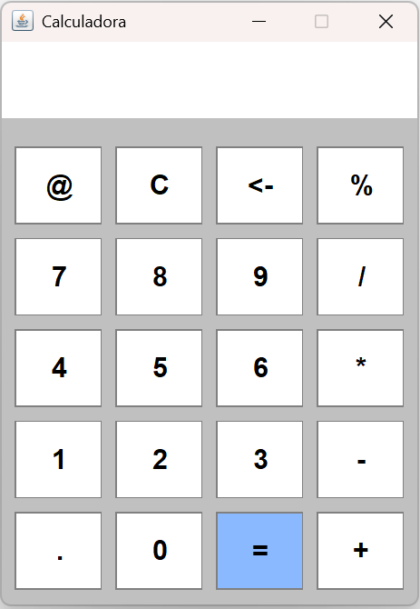
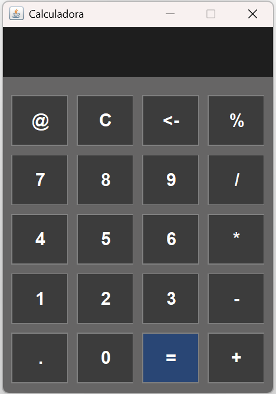
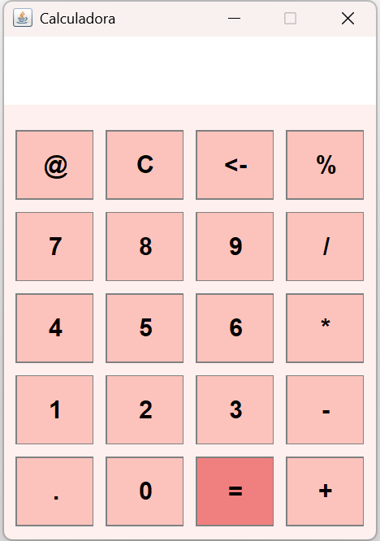

# 🧮 Calculator

Uma calculadora simples desenvolvida em Java usando Swing para a interface gráfica.  
Ela suporta operações matemáticas básicas e troca de tema entre **Claro**, **Escuro** e **Rosa** 🌙🌞🎀

## 💻 Tecnologias usadas

- Java 17+
- Swing (interface gráfica)
- [exp4j](https://www.objecthunter.net/exp4j/) (para avaliar expressões matemáticas)

## 🎨 Temas disponíveis

- Light Theme (Claro)
- Dark Theme (Escuro)
- Pink Theme (Rosa)

Você pode trocar os temas clicando no botão `@` no topo da calculadora!

## 🧠 Funcionalidades

- Operações: soma, subtração, multiplicação, divisão, porcentagem
- Botão `C` para limpar tudo
- Botão `<-` para apagar o último caractere
- Avaliação automática da expressão usando a biblioteca exp4j
- Suporte a múltiplos temas

## 🖼️ Interface

| Claro                   | Escuro                 | Rosa                   |
|-------------------------|------------------------|------------------------|
|  |  |  |

## 🚀 Como executar

1. Clone o repositório:
   ```bash
   git clone https://github.com/sofiavitorino/calculator.git

## 🤝 Contribuições & Sugestões

Contribuições são bem-vindas ✨  
Sinta-se à vontade para abrir uma issue com sugestões de melhoria, correções ou novas funcionalidades que possam tornar o projeto mais completo.

## 💡 Melhorias Futuras

- Adicionar funcionalidades de uma calculadora científica
